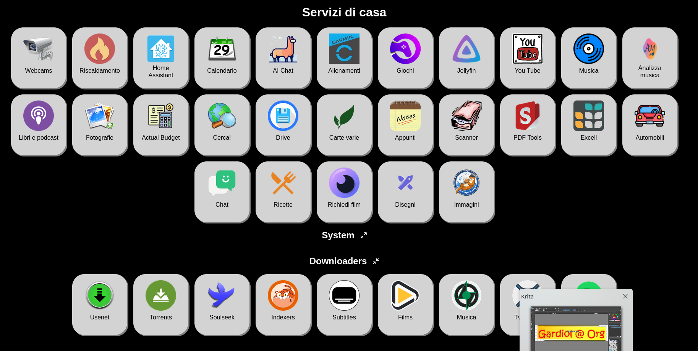

# Simple Dashboard 

Written by Willy Gardiol - willy@gardiol.org

Released under **GPL-v3** [[https://www.gnu.org/licenses/gpl-3.0.en.html]]

## Introduction

This is a pretty simple and mostly static HTML+AlpineJS Dashboard for your web landing pages or self-hosted dashboards.

The concept behind *Simple Dashboard* is to be nice to see, easy to customize and essential in it's funciton yet usable
and functional.

I choose the very lightweight but powerfull AlpineJS (https://alpinejs.dev) as base framework because i like it. 
I was looking for something that did not require __any__ server-side setup beside a basic web-browser.

*Simple Dashboard* does not require docker or podman, does not require python or PIP, NodeJS, NPM or whatever. All you need is a static web server
that can present an HTML page and some static content (images, javascript mostly). 

Optionally, you can check the **bash based** CGI monitor in the usb-folder *monitor*.

Simple Dashboard was born.

## Functionalities

The basic functions of Simple Dashboard are:
- display links to services / pages with customizable styles and optional images and text
- display the HTML output of external requests (like CGI or other pages) 
- dynamically adapt to changes of configuration without the need to clear browser cache
- organize services / pages by groups
- collapsible (open / close) groups

And, complete with the Monitor subfolder stuff:
- system monitoring (load, RAM...)
- resource monitoring (filesystems, mount points...)
- network monitoring (ping, accessibility...)
- service monitoring (PID based monitoring)


## Screenshots

Well, here is a [link](https://www.gardiol.org) to a small personal page.

And here are a couple of screenshots:




## The Concept

Simple Dashboard is an HTML page with as little Javascript embedded as needed. The only underlying dependency is AlpineJS, and it's baked in, so there are no CDN or
external links needed to be resolved. You can deploy Simple Dashboard even without internet access of any kind.

The basic workflow is:
- The browser loads the *index.html* file
- A little bit on Javascript inside tries to read __site.json__, which contains (properly formatted) all you specific links and information to be displayed
- The javascript will then process the JSON file and build the actual page.

The monitoring tools are provided as BASH CGIs, for that you need a webserver with the capability to execute CGIs, like Apache or NGINX with some CGI proxy.

The dashboard is divided in a header, a body composed of rows of items and a footer.

## The Architecture

The main *index.html* provide the basic HTML structure. You need to provide a *site.json* that describe the
content you want to display and an optional *site.css* that provides the aestetics of how to display that content. 
An example *site.json.example* is provided, as well as an empty *site.css*, this file should exist, even if empty.

Some stock (kinda of) images are provided under *images* folder, you will need to drop in your own images of course.

A few basic images are used by the *index.html* itself and they are all located in the same folder as index.html file itself.

## Basic Utilization

Using Simple Dashboard is a matter of cloning the main repository (https://github.com/gardiol/dashboard.git) and creating your own *site.json*. Additionally you might
want to provide your **favicon.png** and edit the **site.css** to your linkings.

Let's see how to create your *site.json*.

### Site.JSON 

This is the core of Simple Dashboard.

Example (comments for reference only, remember that JSON files cannot have comments inside):
```
{
    "title" : "My Dashboard Title",
    "header" : {
        "img" : "optional to display on top of page",
        "text" : "optional to display on top of page"
    },
    "content" : 
    [ {
        "foldable": false,
        "folded": false,
        "title": "my section title",
        "content": 
        [ {
            "img" : "images/webcam.png",
            "text" : "Webcams",
            "link" : "/video/",
            "style" : "otopnal_css_class",
            "new_page" : true
          },{
            "img" : "images/service.png",
            "text" : "My Service",
            "link" : "https://myservice.com",
            "style" : "otopnal_css_class",
            "new_page" : true
          } ],
          [ {
            "text" : "Something running in the dashboard",
            "run" : "/cgi/monitor.sh",
            "style" : "otopnal_css_class",
            "interval" : 5 # in seconds
          } ],
          [ {
            "text" : "Some other periodic update output",
            "run" : "https://myurl_to_display.com",
            "style" : "otopnal_css_class",
            "interval" : 60 # in seconds
          } ]
    } ],
    "footer" : {
        "img" : "",
        "text" : "Contact Willy Gardiol",
        "link" : "mailto://willy@gardiol.org"
        }
    }
```

Note that each item can only have either **link** or **run** but not both.


### Styles


Take a look inside *index.html*, there you will find all the CSS classes that you can modify in your *site.css* file, which will
be loaded after the internal definition, and take precedence. In addition, you can specify the **style** attribute in the *site.json*
and that specific class will be added to your item as well.

In general, an item is a simple structure like this:
```
    <div>
        <a href="link">
            
            <div></div>
            <span>text</span>
        </a>
    </div>
```

The IMG and SPAN are always present, but the DIV is only used for items that run/fetch something.


## Web server example setup

Setting up NGINX for Simple Dashboard is pretty simple, all you need is provide proper access to the folder where you cloned it. As an example guideline, check
the following NGINX setup:

    server {
        server_name www.mydomain.xyz;
        listen 8443 ssl;
        listen 443 ssl;

        index index.html;

        root /path/to/cloned/dashboard/files;
        location / {
        }

        include certbot.conf;
    }


## Monitoring

Simple Dashboard comes with a nice monitoring set of tools based on BASH scripts. Why bash scripts? Because they are easy to audit, 
simple to write, runs everywhere and only requires minimal CGI setup to run.

Am i serious? More or less. I find writing advances bash scripts... fun, so that's why.

The monitor is centered on the **monitor.sh** script, feel free to open it and read it inside out.

You can monitor different groups of information:
- system.sh: print load, RAM, filesystems & mountpoints
- network.sh: print ping reachibility and upstream connection
- services.sh: print process status

There is only *one* script (monitor.sh), you need to make links to it with those different names.
The mix of outputs can be changed by editing the configuration file.

To define different combinations of pages define the following:
    PAGES="services.sh:services system.sh:load:ram:mounts monitor.sh:services:load:ram:mounts:connectivity:pings \

The first (ex: system.sh) is the expected call name, while the others (load:ram:mounts) is the list of pages to display.

There is a second setting you need to specify:
    BASE_URL="/"

Each "page" of information is built on specific templates under the "monitor/templates" folder, you can edit those to fit your output style. The monitor will also 
require a **monitor.css** file located under the BASE_URL folder.


### List of possible monitors

The following monitors are available, for each one it's usage is described.

#### connectivity

Print if you ISP is working and can reach internet
    UPLINKS="vodafone:192.168.0.1:99.99.99.99 fastweb:192.168.1.254:98.98.98.98"

Where:
- vodafone: ISP name (for display purpose)
- 192.168.0.1: ISP router IP, to check if it's on and reacheable
- 99.99.99.99: example IP reachable trough this ISP, to check for actual internet access via this ISP

you can define as many ISPs as you have direct connection to. It is highly recomended to use IP and not hostnames, as the latter might be
dependent on DNS working to resolve and are best checked with the __pings__ tests.

#### pings

Ping hosts, IPs or hostnames, to check if they are alive.
    PINGS="host1:10.70.43.3 host2:10.70.43.4 host3:10.70.43.10"

Where:
- host1/2/3: name of host (for display purposes)
- 10.70.43.x: ip or hostname to ping

#### mounts

Monitor mount points and associated filesystem free space
    MOUNTPOINTS="Data:/data Root:/ Backup:/storage/backup/NAS"
    FILESYSTEM_LIMIT=90

Where:
- Data: mount point name, for display purposes
- /data: actual mount point to monitor
- FILESYSTEM_LIMIT: percentage over which it will be red or green

#### services

Print services status, green if they are up red otherwise. To check if a process is running, it's PID will be used and matched agains /proc/<pid>/status:
    SERVICES_PIDS="Audiobookshelf:/var/run/audiobookshelf.pid"

Where:
- Audiobookshelf: name of service, for display purpose
- /var/run/audiobookshelf.pid: pid of process

#### load

Print last load factor for 1 minute, 5 minutes and 15 minutes:
    LOAD_MAX=20
    LOAD_MIN=19

Where:
- LOAD_MAX: above this level, it will print in red
- LOAD_MIN: below this level, it will print in green

between MIN and MAX will be print in grey.

#### ram

Print free RAM & SWAP in megabytes and in percentage:
    MEMORY_LIMIT=20
    SWAP_LIMIT=20

Where:
- MEMORY_LIMIT: percentage above which color is red
- SWAP_LIMIT: percentage above which color is red


### Monitoring web server example

To run the monitors, you need CGI support in your webbrowser. For NGINX, refer to the following example configuration:


    location /mysystemurl/network-monitor {
    	fastcgi_param DOCUMENT_ROOT /path/to/my/monitor/cgi-bin/;
    	fastcgi_param SCRIPT_NAME   network.sh;
    	fastcgi_pass unix:/var/run/fcgiwrap.sock-1;
    }   

and call it in your *site.json* as:
    {
		"text" : "Network",
		"run" : "network-monitor",
		"interval" : 5,
		"style" : "runner"
	}

You also need to setup and enable FCGIWRAP to give NGINX support for CGIs.


